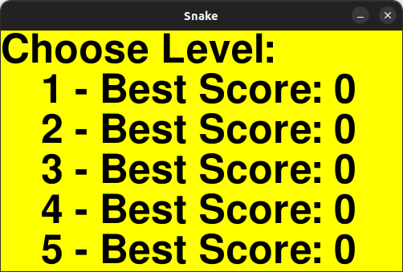
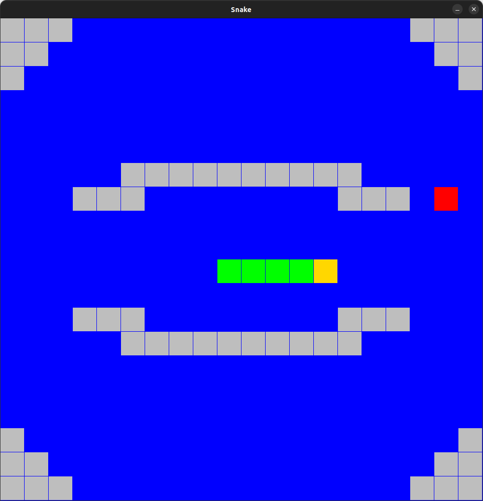

# MySnakeGame

## Run Locally

Clone the project

```bash
  git clone ...
```

Go to the project directory

```bash
  cd snakeGame
```

Run the project

```bash
  python main.py
```

# Game instructions

## Menu



Here you can choose level you want to play and see previous best scores.

Press on your keyboard the number of level you chose to play it.

Press 'q' on your keyboard if you want to quit the game.

## Level



Yellow square is the head of your snake.

Red square is the apple your snake can eat.

Gray squares are the walls.

Green squares are the body of your snake.

Control the head of your snake by pressing 'w', 'a', 's' and 'd' on your keyboard.

You can always press 'b' on your keyboard to return back in menu.

Eat apples by snake's head to get the highest score.

Avoid bumping into walls and into snake's body by the head of your snake.

Notice that your snake can go throw the boarders of the field if there are no walls there!
